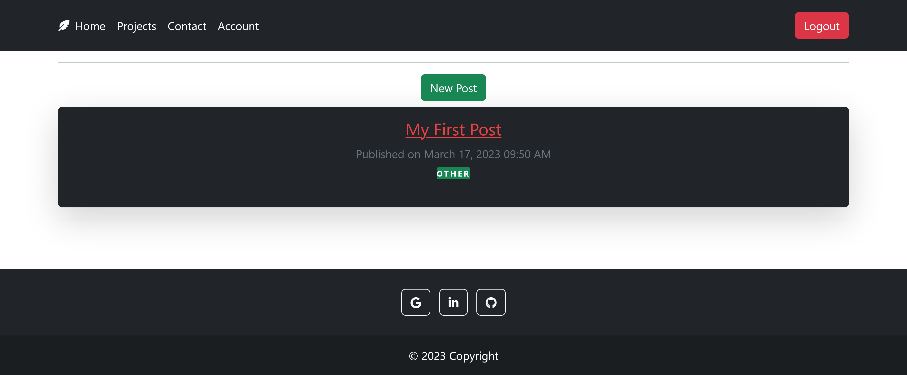
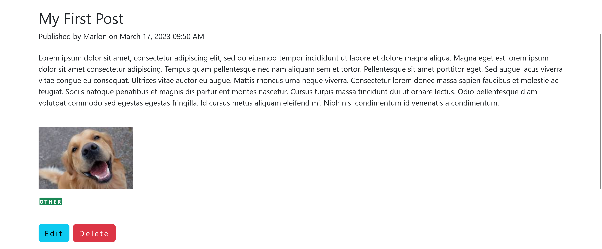
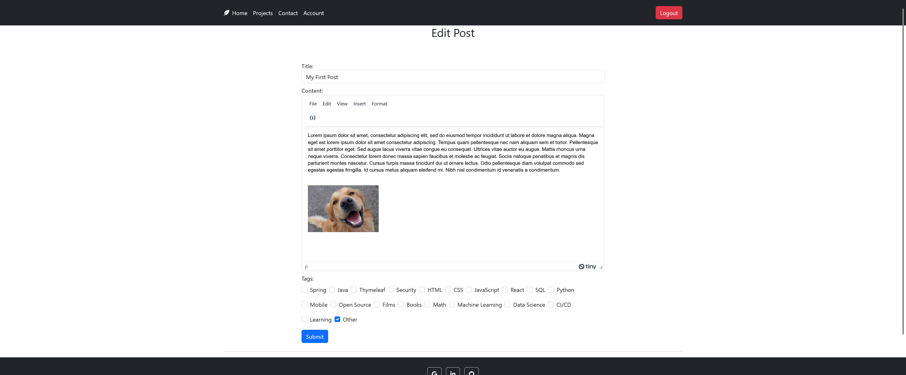
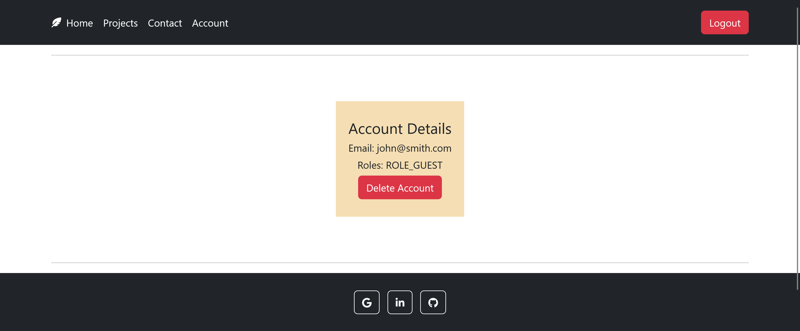
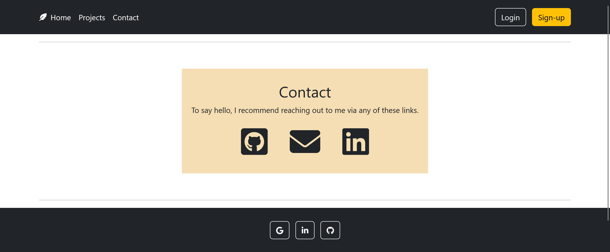

## [Blog](https://blog-complete.azurewebsites.net/)
A place to document what I am learning/interested in, and to show my portfolio.

JAVA VERSION
* Java 17
  Dependencies (SpringBoot):
* Data JPA
* JDBC
* Spring Security
* Thymeleaf
* Spring Web
  hibernate-validator
* Mysql Connector J
* MssSQL JDBC
* Bootstrap
* webjars-locator
* webjars-locator-core
* lombok
* Spring-boot-starter-test
* Spring-security-test
* annotations
* Spring Actuator

Front page for Admin and Guest

The Admin user has create/edit/delete privileges that a Guest does not have

The user can now create an account

The user can then log in to their account (As of now there are no special privileges for having an account)

Your account page is displayed, showing the logged-in user's email and their roles.

Projects

Contact
